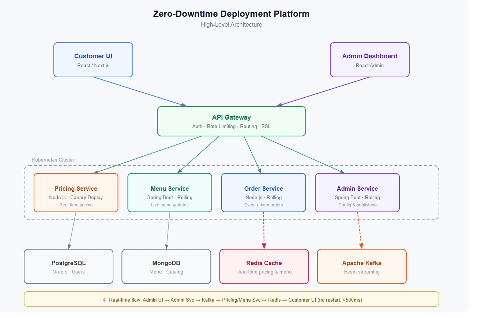
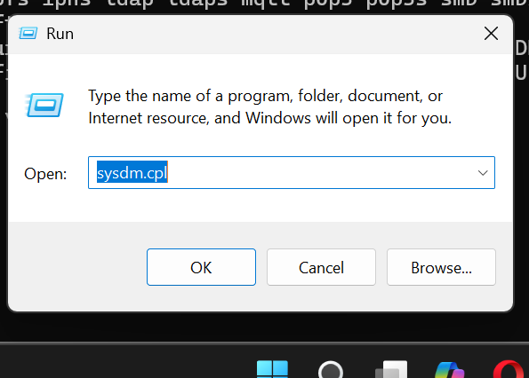

Project Overview

This project solves the problem of service disruption during deployments.
Previously, any backend update required a full system restart, causing 15-minute downtime during peak dinner hours.

Our solution enables:

Zero-downtime deployments

Real-time pricing updates

Real-time menu updates

Canary / Rolling deployments

Production-like staging environment

Horizontal scalability across cities

Architecture
High-Level Components

API Gateway

Microservices (Pricing, Menu, Order, Admin)

Customer UI

Admin Dashboard UI

Kubernetes Cluster

CI/CD Pipeline

Redis Cache

Message Broker

Monitoring Stack

Tech Stack

Backend

Node.js / Spring Boot (Microservices)

REST APIs

Event-driven architecture

Frontend

React / Next.js (Customer UI)

React Admin Dashboard

DevOps

Kubernetes

Docker

GitHub Actions (CI/CD)

Argo CD

Helm Charts

Data & Messaging

PostgreSQL / MongoDB

Redis

Apache Kafka

Monitoring

Prometheus

Grafana

Deployment Strategy

Rolling Updates (default)

Canary Deployment for pricing updates

Automatic rollback on failure

Separate staging and production clusters

Real-Time Updates Flow

Admin updates pricing/menu via dashboard

Event published to Kafka

Pricing/Menu service consumes event

Redis cache updated instantly

Customer UI reflects changes in real-time

No restart required. No downtime.

Project Structure
/frontend
/customer-ui
/admin-ui

/backend
/pricing-service
/menu-service
/order-service
/admin-service

/devops
/k8s-manifests
/helm-charts
/ci-cd

CI/CD Artifact Flow

Source → Image → Registry → Cluster

=>Objective

To understand how a Git commit becomes a deployable artifact and runs inside a Kubernetes cluster using a CI/CD pipeline.

Artifact Flow Overview

In modern DevOps, code is not deployed directly.
Each change becomes an immutable artifact that moves through controlled stages:

Source (Git Commit)
↓
CI Pipeline
↓
Docker Image
↓
Container Registry
↓
Kubernetes Cluster

1️ Source (Git)

Developer pushes code or merges a Pull Request

Each commit has a unique commit hash

The commit triggers the CI pipeline

The commit identifies exactly what version of code is being built.

2️ CI Pipeline

The CI pipeline (e.g., GitHub Actions):

Checks out code

Runs tests

Builds a Docker image

Tags the image

Pushes it to a registry

CI produces a Docker image artifact — it does not deploy source code directly.

3️ Docker Image (Immutable Artifact)

A Docker image contains:

Application code

Dependencies

Runtime

Configuration

Images are immutable.
Every new commit creates a new image.

Example:

app:commit-a1b2
app:commit-c3d4

4️ Image Tags and Digests

Image Tags
Human-readable labels (latest, v1.2.0, commit-xyz).

Image Digests
Cryptographic identifiers (sha256:...) that guarantee the exact image version.

5️ Container Registry

Images are stored in a registry (Docker Hub, GitHub Container Registry, AWS ECR).

Registries provide:

Version storage

Traceability (image → commit)

Secure access

Kubernetes pulls images from the registry.

6️ Kubernetes Deployment

Kubernetes runs the image in the cluster.

Deployment defines:

Image name

Tag/version

Replicas

Rolling update strategy

When the image changes, Kubernetes performs a rolling update without downtime.

Rollbacks

If a release fails:

Identify the previous stable image

Update deployment to that image

Kubernetes rolls back automatically

Rollbacks are safe because:

Images are immutable

Registry stores history

Deployments reference exact versions

**✨ Sprint 3 Implementation: Docker Hub Registry Workflow**

A complete Docker registry workflow has been implemented for this project, demonstrating:

- Image building and multi-tag strategy (`latest`, `sprint3`, `commit-<SHA>`)
- Pushing/pulling images from Docker Hub
- CI/CD automation with GitHub Actions
- Local development scripts for manual testing

**📖 Documentation:** See [devops/registry/dockerhub-usage.md](devops/registry/dockerhub-usage.md) for detailed setup instructions, scripts, and real-world rollback scenarios.

**🔧 Scripts:**

- `devops/registry/build-and-tag.sh` - Build and tag images locally
- `devops/registry/push.sh` - Push images to Docker Hub

**🚀 CI/CD:** `.github/workflows/registry-ci.yml` automatically builds and pushes images on every push to `main`

**⚙️ GitHub Secrets Configuration:**

To enable automated CI/CD workflow, configure these repository secrets:

1. Go to **Settings** → **Secrets and variables** → **Actions** → **New repository secret**
2. Add two secrets:
   - `DOCKERHUB_USERNAME` - Your Docker Hub username
   - `DOCKERHUB_TOKEN` - Docker Hub access token (generate at [Docker Hub Security Settings](https://hub.docker.com/settings/security))

Without these secrets, the automated workflow will fail with "Username and password required" error.

---

[Learning Concept-2] Kubernetes Application Lifecycle & Deployment Mechanics

In this lesson, you’ll explore how Kubernetes manages the full lifecycle of an application - from creation and scheduling to updates, failures, and recovery.

You’ll move beyond “Kubernetes runs containers” to understanding what actually happens inside the cluster when you deploy, scale, update, or break an application.

By the end of this lesson, you’ll be able to reason about pod behavior, understand rollout outcomes, and diagnose common failure states - critical skills for operating real production systems.

Objective
To help students understand how Kubernetes creates, manages, updates, and recovers workloads.

Students should be able to:

Explain pod creation and scheduling
Describe the role of ReplicaSets during deployments
Understand how health probes and resource limits affect pod behavior
Identify common failure states and what they indicate during deployments
Here’s What You Need to Understand

1. The Kubernetes Application Lifecycle (Big Picture)
   When you deploy an application to Kubernetes, it goes through a well-defined lifecycle.

At a high level:

Deployment Created
↓
ReplicaSet Created
↓
Pods Created
↓
Pods Scheduled on Nodes
↓
Containers Start
↓
Health Checks Pass
↓
Application Becomes Available
Kubernetes continuously watches this process and tries to keep the system in the desired state.

2. Pod Creation & Scheduling
   A Pod is the smallest unit Kubernetes deploys.

What Happens When You Apply a Deployment
You apply a Deployment manifest
Kubernetes creates a ReplicaSet
The ReplicaSet creates the required number of Pods
The Scheduler assigns each Pod to a Node
The kubelet on that node starts the container
Key Insight: You never create Pods directly in production - Deployments and ReplicaSets manage them for you.

3. ReplicaSets - Maintaining Desired State
   A ReplicaSet ensures that the desired number of pods are always running.

Example:

replicas: 3
What the ReplicaSet does:

If a pod crashes → a new pod is created
If a node fails → pods are recreated elsewhere
If replicas are increased → new pods are started
If replicas are decreased → pods are terminated
Key Idea: ReplicaSets are the self-healing mechanism behind Kubernetes deployments.

4. Deployment Rollouts & Update Mechanics
   When you update your application (for example, a new image version), Kubernetes performs a rollout.

Rolling Update Strategy (Default)
During a rollout:

New pods are created with the new image
Old pods are terminated gradually
Traffic shifts incrementally
Availability is maintained
Possible rollout outcomes:

Successful rollout → all new pods become ready
Paused rollout → waiting for manual intervention
Failed rollout → new pods never become healthy
You can inspect rollout state using:

Deployment status
Pod readiness
ReplicaSet history 5. Health Probes - How Kubernetes Knows a Pod Is Healthy
Kubernetes does not guess pod health - it uses probes.

Types of Probes
Liveness Probe Checks if the container is alive → Failing this causes a container restart

Readiness Probe Checks if the pod can receive traffic → Failing this removes the pod from service load balancing

Startup Probe Used for slow-starting applications → Prevents premature restarts

Key Insight: Incorrect probes are one of the most common causes of broken deployments.

6. Resource Limits & Scheduling Behavior
   Each pod can define:

CPU requests & limits
Memory requests & limits
These directly affect:

Whether a pod can be scheduled
Whether it gets throttled
Whether it gets terminated
Common behaviors:

CPU limit exceeded → throttling
Memory limit exceeded → pod is OOMKilled
Requests too high → pod stuck in Pending 7. Common Pod States & Failure Conditions
Understanding pod states is essential for debugging.

Common Pod States
Pending → Scheduler cannot place the pod
Running → Container is executing
CrashLoopBackOff → App keeps crashing
ImagePullBackOff → Image cannot be pulled
OOMKilled → Memory limit exceeded
Terminating → Pod is shutting down
Each state tells you exactly where the failure is happening.

8. Failure Recovery & Self-Healing
   Kubernetes automatically responds to failures:

Pod crashes → restarted
Node fails → pods rescheduled
Health checks fail → traffic rerouted
Replica count violated → corrected
Important: Kubernetes guarantees desired state, not that your application logic is correct.

9. What You Should Be Able to Explain After This Lesson
   You should confidently explain:

How pods are created and scheduled
How ReplicaSets maintain availability
What happens during a rolling update
How probes affect pod lifecycle
Why pods fail and how Kubernetes reacts
Tips for Success
Always start debugging from Pod status
Think in terms of desired vs current state
Remember: Kubernetes reacts to signals — probes, limits, and configs matter
Use mental models, not memorization
Pro Tip: If you understand why a pod is unhealthy, you understand Kubernetes.

Additional Reference Resources
Kubernetes Concepts Overview

Pods

Deployments

ReplicaSets

Probes (Liveness, Readiness, Startup)

Resource Management for Pods

By mastering Kubernetes application lifecycle mechanics, you gain the ability to deploy confidently, debug failures quickly, and operate systems reliably — the core responsibility of any DevOps or platform engineer.

---

# 🍽 Feast Flow

## CI/CD Pipeline Execution Model & Responsibility Boundaries

---

## Project Overview

Feast Flow is a cloud-native DevOps implementation designed to eliminate service disruptions during application updates.

Previously, pricing algorithm and restaurant menu updates required full system restarts, causing 15-minute downtime during peak dinner hours across 30+ cities.

This project transitions from manual deployments to a fully automated CI/CD pipeline using:

- Docker (Containerization)
- GitHub Actions (CI/CD Automation)
- Kubernetes (Container Orchestration)
- AWS Cloud Infrastructure

The goal is zero-downtime deployments, scalable infrastructure, and reliable automated releases.

---

# CI/CD Execution Model (Big Picture)

Code Change
↓
CI Pipeline (Build & Test)
↓
Docker Image Creation
↓
CD Pipeline (Deploy)
↓
Kubernetes Cluster (AWS)
↓
Rolling Update (Zero Downtime)

Each stage has clear responsibilities and ownership.

---

# Continuous Integration (CI)

CI is responsible for validating code changes.

## CI Responsibilities

- Checkout source code
- Run automated tests
- Perform static checks (if configured)
- Build Docker image
- Tag Docker image
- Push image to container registry
- Fail fast if build or tests fail

## Trigger Conditions

- Pull Requests
- Push to branches

## Key Principle

CI answers:

> “Is this code safe to merge?”

CI does NOT deploy to production.

---

# Continuous Deployment (CD)

CD is responsible for safely releasing validated artifacts.

## CD Responsibilities

- Pull pre-built Docker image from registry
- Update Kubernetes Deployment manifests
- Apply manifests to cluster
- Perform rolling updates
- Manage rollback if necessary

## Key Principle

CD answers:

> “How do we safely run this version in production?”

CD does NOT rebuild code. It deploys images created by CI.

---

# Responsibility Breakdown

| Action                        | Owner            |
| ----------------------------- | ---------------- |
| Writing business logic        | Application Code |
| Writing unit tests            | Application Code |
| Running tests                 | CI Pipeline      |
| Building Docker image         | CI Pipeline      |
| Tagging & pushing image       | CI Pipeline      |
| Updating Kubernetes manifests | CD Pipeline      |
| Applying manifests to cluster | CD Pipeline      |
| Restarting failed pods        | Kubernetes       |
| Scaling replicas              | Kubernetes       |

---

# Responsibility Boundaries

## 1️. Application Code

- Implements pricing logic and menu updates
- Defines tests
- Does NOT directly deploy

---

## 2️. CI Pipeline

- Validates code
- Builds Docker images
- Pushes artifacts
- Prevents broken code from moving forward

---

## 3️. CD Pipeline

- Deploys validated Docker images
- Updates Kubernetes resources
- Ensures safe production rollout

---

## 4️. Infrastructure (Kubernetes + AWS)

- Runs containers
- Maintains replica count
- Performs rolling updates
- Self-heals failed pods
- Ensures high availability

---

# Why Separation of Responsibilities Matters

Before DevOps:

- Manual deployment
- Full system restart
- 15-minute downtime
- High production risk

After DevOps:

- Automated validation
- Rolling deployments
- Zero downtime
- Faster and safer releases

Benefits:

- Safe Pull Requests
- Predictable deployments
- Reduced human error
- Easy rollback capability
- Improved scalability

---

# Safe Pipeline Modifications

Pipeline files are production-critical.

Modifying:

- Test steps → affects CI validation
- Docker build steps → affects artifacts
- Deployment steps → affects live systems

Therefore:

- Pipeline files must be version-controlled
- Changes require review
- Protected branches should be enforced
- Modifications must be minimal and intentional

---

# Common Misconceptions

CI deploys code → Incorrect  
CD rebuilds application → Incorrect  
Pipelines replace Kubernetes → Incorrect

Correct Mental Model:

- CI builds confidence
- CD moves artifacts
- Kubernetes runs and heals systems

---

# Functional Requirements

- CI pipeline builds and validates Docker images
- CD pipeline deploys to Kubernetes automatically
- Kubernetes restarts failed containers
- Application remains accessible during updates

---

# Non-Functional Requirements

- Reliability: System recovers from pod failure
- Scalability: Supports multiple replicas
- Consistency: Same Docker image runs everywhere
- Automation: No manual deployment steps

---

# Deployment & Testing Strategy

## Testing

- CI validates builds
- Containers run locally and in cluster
- Manual validation of rolling updates
- Failure simulation (pod deletion)

## Deployment Flow

1. Build Docker image via CI
2. Push image to registry
3. Deploy via Kubernetes manifests
4. Validate service availability

---

# Success Metrics

- Fully automated CI/CD pipeline
- Successful Kubernetes deployment
- Demonstrated rolling update
- Stable public endpoint
- Clear documentation and demo readiness

---

# Final Outcome

Feast Flow now supports:

- Zero-downtime deployments
- Automated CI/CD workflows
- Scalable cloud infrastructure
- Reliable production releases
- Faster feature delivery across 30+ cities

---

## Key Takeaway

This project demonstrates a clear CI/CD execution model where:

- CI validates code
- CD deploys artifacts
- Kubernetes ensures reliability

Separation of responsibilities enables safe releases, predictable deployments, and production-grade DevOps workflows.

=>High-Level-Design

High-Level Design (HLD)
Overview

The Zero-Downtime Deployment Platform is built using a microservices architecture deployed on Kubernetes. The system ensures continuous deployment, real-time updates, and no service interruption during releases.

Architecture Components

1. Frontend Layer

Customer UI (React / Next.js) – Used by customers to browse menus and place orders.

Admin Dashboard (React Admin) – Used to manage pricing, menus, and configurations.

Both communicate through a centralized API Gateway.

2. API Gateway

Acts as the single entry point for all client requests.

Handles:

Authentication & Authorization

SSL termination

Rate limiting

Routing to backend services

3. Backend Microservices

Deployed inside a Kubernetes cluster:

Pricing Service (Node.js) – Manages real-time pricing (Canary deployments).

Menu Service (Spring Boot) – Handles menu updates (Rolling deployments).

Order Service (Node.js) – Processes customer orders.

Admin Service (Spring Boot) – Publishes configuration updates.

Each service is independently scalable and deployable.

4. Data & Messaging Layer

PostgreSQL – Orders and user data

MongoDB – Menu and catalog data

Redis – Caching for real-time performance

Apache Kafka – Event streaming between services

Real-Time Update Flow

Admin Update
→ API Gateway
→ Admin Service
→ Kafka
→ Pricing/Menu Service
→ Redis
→ Customer UI

Updates reflect instantly without restarting services (< 500ms).

## Work Reference - February 17, 2026

# DevOps Environment Setup

## System Information

- **OS:** Windows 11
- **Shell:** PowerShell
- **Kubernetes Environment:** Docker Desktop Kubernetes

---

## Tools Installed & Verified

| Tool        | Verification Command       | Status          |
| ----------- | -------------------------- | --------------- |
| Git         | `git --version`            | Working         |
| Docker      | `docker --version`         | Working         |
| Docker Test | `docker run hello-world`   | Successful      |
| kubectl     | `kubectl version --client` | Installed       |
| Kubernetes  | `kubectl get nodes`        | Cluster Running |
| Helm        | `helm version`             | Working         |
| Curl        | `curl.exe --version`       | Working         |

---

## Notes

- Docker Desktop installed and running.
- Kubernetes enabled from Docker Desktop settings.
- All tools verified via CLI.
- Screenshots included in this folder as proof.

---

## Status

DevOps environment successfully configured and ready for containerized and Kubernetes-based deployments.

---

### Setup Verification Screenshots

---

# 🍽 Feast Flow – Sprint #3

# Low-Level Design (LLD)

## DevOps with Kubernetes & CI/CD

---

# 1️ Introduction

This document represents the Low-Level Design (LLD) for the Feast Flow DevOps architecture.

The goal of this LLD is to define implementation-level details of:

- Application container structure
- CI pipeline execution
- CD pipeline deployment mechanics
- Kubernetes resource configuration
- Pod-level behavior
- Data and control flow
- Assumptions and constraints

This document is implementation-ready and can be used by another engineer to build the system.

---

# 2️ System Components & Internal Structure

## 2.1 Application Container

**Responsibility:**

- Hosts Feast Flow web application
- Handles pricing algorithm updates
- Handles restaurant menu updates
- Exposes HTTP endpoint

**Technology:**

- Docker container
- Single application container per pod

---

**Responsibility:**

- Validate code
- Run tests
- Build Docker image
- Tag and push image to registry

---

**Responsibility:**

- Deploy validated Docker image
- Update Kubernetes Deployment
- Trigger rolling update

---

**Resources Used:**

- Deployment
- Service
- ConfigMap
- Secret

---

## 2.5 Configuration & Secret Handling

- Non-sensitive config → ConfigMap
- Sensitive data → Kubernetes Secret
- Environment variables injected into container

---

# 3️ CI Pipeline – Step-by-Step Execution

## Trigger Conditions

- On Pull Request to main
- On push to main branch

---

## CI Execution Flow

### Step 1 – Checkout Code

**Input:** GitHub repository  
**Output:** Source code in runner environment

---

### Step 2 – Install Dependencies

**Purpose:** Prepare environment

---

### Step 3 – Run Tests

**Input:** Application source code  
**Output:** Test result (pass/fail)  
If failed → pipeline stops

---

**Final Output of CI:**
Docker image stored in container registry.

CI ensures only tested images move forward.

---

# 4️ CD Pipeline – Deployment Mechanics

## Deployment Trigger

- Triggered after successful CI
- Runs only on main branch

---

## Deployment Steps

### Step 1 – Authenticate to Kubernetes Cluster

### Step 2 – Update Deployment Image

### Step 3 – Apply Manifests

---

## Health Probes

### Liveness Probe

Checks application health endpoint.

### Readiness Probe

Ensures pod receives traffic only when ready.

---

# 7️ Data & Control Flow

## Code Change → CI

1. Developer pushes code
2. GitHub triggers CI
3. Tests executed
4. Docker image built
5. Image pushed to registry

---

## Image → Registry → CD

1. CD pipeline triggered
2. Image tag selected
3. Deployment updated
4. Rolling update begins

---

## Deployment → Pod Rollout

1. New pod created
2. Health checks pass
3. Old pod terminated
4. No downtime

---

## User Request Flow

User → LoadBalancer → Service → Pod → Application Container

---

# 8️ Assumptions & Constraints

## Assumptions

- Single production environment
- One application service
- Manual rollback
- Fixed replica count
- No autoscaling

---

## Constraints

- No service mesh
- No advanced monitoring stack
- No custom autoscaling
- Limited cloud budget
- Basic security configuration

---

# 9️ Visual LLD Diagrams (To Be Added)

The following diagrams must be exported as:

- .png / .jpg / .jpeg

Required Diagrams:

1. CI/CD Execution Flow Diagram
2. Kubernetes Resource Interaction Diagram
3. Pod-Level Architecture Diagram

Legend must explain:

- Pipelines
- Registry
- Kubernetes resources
- Control flow arrows

Diagram link (if hosted) must be added in .txt file.

---

# Final Outcome

This Low-Level Design defines:

- Internal DevOps system execution
- CI/CD responsibility separation
- Kubernetes deployment mechanics
- Pod runtime behavior
- Clear control and data flow

This document serves as the final technical blueprint before implementation.

---

# Key Principle

CI builds confidence  
CD moves artifacts  
Kubernetes runs and heals systems

Clear separation ensures safe, predictable, zero-downtime deployments.

Contributions

Designed the complete High-Level Design (HLD) and Low-Level Design (LLD) for the zero-downtime deployment architecture.

Defined microservices-based system architecture including API Gateway, backend services, frontend applications, and data layer.

Documented real-time update flow using Apache Kafka and Redis for instant pricing and menu updates.

Implemented and configured CI pipeline using GitHub Actions for automated build, test, Docker image creation, and registry push.

Designed CD workflow to deploy validated Docker images to Kubernetes using rolling update strategy.

Created and structured Kubernetes manifests including Deployments, Services, ConfigMaps, and Secrets.

Configured health probes (Liveness and Readiness) and resource limits to ensure application stability and reliability.

Defined rollback strategy using immutable Docker images and controlled deployment versions.

Set up and verified DevOps environment (Git, Docker, Kubernetes, kubectl, Helm) on local system.

Structured repository with clear separation of frontend, backend, and DevOps components.

Applied structured Git practices including feature-based branching, meaningful commit conventions, and Pull Request-based integration workflow.

---

Docker-Architecture-Explanation

# 🍽 Feast Flow – Sprint #3

# Understanding Docker Architecture: Images, Containers, and Layers

---

## 1️⃣ Purpose of This Document

This document explains Docker architecture in the context of the Feast Flow DevOps system.

The goal is to demonstrate a clear understanding of:

- Docker as a platform
- Immutable images
- Image layers and caching behavior
- Containers as runtime instances
- Image–container lifecycle
- Why Docker architecture matters for CI/CD and Kubernetes

This explanation connects conceptual Docker knowledge directly to our CI/CD pipeline and Kubernetes deployment model.

---

# 2️⃣ Docker as a Platform in Feast Flow

Docker is not just a CLI tool. It is a platform that:

- Builds immutable images
- Manages layered filesystems
- Runs containers as isolated processes
- Integrates with CI pipelines
- Supplies artifacts to Kubernetes

In Feast Flow:

- GitHub Actions builds Docker images in CI.
- The image is pushed to a container registry.
- Kubernetes pulls the image and runs it as containers.
- Rolling updates replace old containers with new ones.

Docker acts as the bridge between development and production.

---

# 3️⃣ Docker Images as Immutable Artifacts

A Docker image is a read-only blueprint of the application.

Key properties:

- Images are immutable.
- Any change creates a new image.
- Images can be versioned using tags (e.g., commit SHA).
- The same image runs across environments.

In Feast Flow:

Each code change:

1. Triggers CI.
2. Builds a new Docker image.
3. Tags it using commit SHA.
4. Pushes it to the registry.
5. Deploys that exact image to Kubernetes.

This ensures reproducibility across 30+ cities with zero environment drift.

---

# 4️⃣ Understanding Layers and Their Impact

Docker images are composed of layers.

Each instruction in a Dockerfile (e.g., RUN, COPY, ADD) creates a new layer.

Layers are:

- Cached
- Reused across builds
- Stacked to form the final image

### Why Layer Ordering Matters

If dependency installation happens before copying source code:

- Dependency layers remain cached
- Only application code layer rebuilds
- CI build time improves

If ordered incorrectly:

- Small source changes invalidate earlier layers
- Entire image rebuilds
- CI becomes slow

In Feast Flow, proper layer ordering improves CI performance and reduces pipeline execution time.

---

# 5️⃣ Containers as Runtime Instances

A container is a running instance of an image.

Important distinction:

Image → Immutable blueprint  
Container → Running process with writable layer

Containers add a thin writable layer on top of the image.

If a container stops:

- Its writable changes are lost
- The image remains unchanged

In Feast Flow:

- Kubernetes runs containers from Docker images.
- If a pod is deleted, Kubernetes creates a new container from the same image.
- Runtime changes inside a pod do not modify the original image.

This prevents configuration drift and ensures deployment consistency.

---

# 6️⃣ Image–Container Lifecycle in Feast Flow

The lifecycle flow:

Code Change
↓
Docker Build
↓
Layers Created
↓
Image Generated
↓
Image Pushed to Registry
↓
Kubernetes Pulls Image
↓
Container Created
↓
Pod Runs Application

Build-time concerns:

- Dependencies
- Filesystem setup
- Application packaging

Runtime concerns:

- Environment variables
- Resource allocation
- Health checks
- Traffic handling

Separating build-time and runtime responsibilities ensures predictable deployments.

---

# 7️⃣ Why Docker Architecture Matters for Performance

Misunderstanding Docker architecture leads to:

- Large images
- Slow CI builds
- Cache invalidation issues
- Hard-to-debug runtime behavior
- Inconsistent production deployments

In Feast Flow, efficient Docker usage ensures:

- Faster CI pipelines
- Smaller images
- Reliable Kubernetes rollouts
- Reduced downtime during updates
- Predictable scaling across multiple cities

---

# 8️⃣ Docker’s Role in CI/CD Execution Model

In our DevOps architecture:

CI:

- Builds Docker image
- Validates image
- Pushes image to registry

CD:

- Pulls immutable image
- Updates Kubernetes deployment
- Triggers rolling update

Kubernetes:

- Runs containers
- Self-heals failed pods
- Maintains replica count

Clear responsibility separation:

Docker builds artifacts  
CI validates artifacts  
CD deploys artifacts  
Kubernetes runs artifacts

---

# 9️⃣ Common Misconceptions Clarified

“Editing files inside a container updates the image” → Incorrect  
“Docker image changes at runtime” → Incorrect  
“Containers persist state by default” → Incorrect

Correct understanding:

Images are immutable.  
Containers are ephemeral runtime instances.  
State must be managed explicitly.

---

# 🔟 Conclusion

Understanding Docker architecture allows us to:

- Predict build behavior
- Optimize CI performance
- Maintain consistent deployments
- Prevent runtime drift
- Debug container failures effectively

In Feast Flow, Docker is the foundation of our CI/CD pipeline and Kubernetes deployment strategy.

A strong conceptual understanding ensures that we move from mechanical Docker usage to informed engineering decisions.

---

# 🔥 Key Takeaways

- Images are immutable artifacts.
- Layers impact caching and performance.
- Containers are runtime instances of images.
- Build-time and runtime concerns must remain separate.
- Docker enables consistent, reproducible zero-downtime deployments.

---

# 🍽 Feast Flow – Dockerfile Design (Sprint #3)

## Purpose

This Dockerfile is designed following Docker best practices to ensure:

- Efficient layer caching
- Minimal image size
- Secure container runtime
- Deterministic CI builds
- Reliable Kubernetes deployments

---

# 1️⃣ Base Image Selection

We selected:

node:20-alpine

Reasons:

- Official Node.js image
- Alpine variant reduces image size
- Maintained and secure
- Suitable for production workloads

Trade-off:

- Alpine images may require additional libraries for certain native modules.

---

# 2️⃣ Layer Optimization Strategy

Layer ordering is structured for optimal caching:

1. Copy package.json first
2. Install dependencies
3. Copy application source code

Why?

Dependencies change less frequently than source code.
This allows Docker to reuse cached dependency layers when only application code changes.

Result:

- Faster CI builds
- Reduced rebuild times
- More efficient pipelines

---

# 3️⃣ Production Dependency Installation

Using:

npm ci --only=production

Benefits:

- Clean dependency installation
- Faster builds
- Ensures lockfile consistency
- Prevents unnecessary dev dependencies

---

# 4️⃣ Security Best Practices

- Non-root user created
- Container does not run as root
- Minimizes attack surface

This improves production security in Kubernetes.

---

# 5️⃣ Build-Time vs Runtime Separation

Build-time:

- Installing dependencies
- Setting up filesystem
- Packaging application

Runtime:

- Running Node server
- Handling requests
- Consuming environment variables

This separation ensures predictable behavior across environments.

---

# 6️⃣ Deterministic Image Artifact

The Dockerfile ensures:

- Same image built locally and in CI
- No local machine dependencies
- Fully reproducible builds

In Feast Flow CI/CD:

CI:

- Builds image
- Tags image with commit SHA
- Pushes image to registry

CD:

- Deploys immutable image to Kubernetes

This guarantees consistent deployment across 30+ cities.

---

# 7️⃣ Impact on CI/CD Performance

Proper layer ordering:

- Reduces rebuild time
- Minimizes pipeline delays
- Improves developer feedback loop

Small inefficiencies in Dockerfiles compound over repeated CI executions.
This design prevents slow builds and image growth.

---

# 🔥 Key Takeaways

- Base image affects size and security.
- Layer ordering affects caching and build speed.
- Containers should run as non-root.
- Dockerfiles must be deterministic.
- Efficient Dockerfiles improve DevOps reliability.

Sprint #3 – ConfigMaps & Secrets
Overview

Externalized configuration for better security, flexibility, and environment portability. Sensitive data is moved to Kubernetes Secrets; non-sensitive settings use ConfigMaps.

Configuration

ConfigMap: Non-sensitive settings like app name, log level, API endpoints.

Secret: Sensitive data like passwords and tokens.

Usage

Injected into the Deployment as environment variables:

env:

- name: APP_NAME
  valueFrom:
  configMapKeyRef:
  name: app-config
  key: app_name
- name: DB_PASSWORD
  valueFrom:
  secretKeyRef:
  name: app-secret
  key: db_password
  Benefits

No hardcoded configuration

Secure handling of secrets

Easy environment-specific changes
